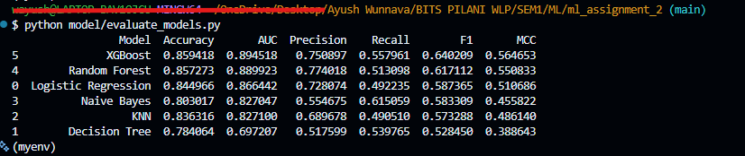

# STUDENT INFO
NAME: Ayush Wunnava

BITS ID: 2025AA05765

BITS EMAIL: 2025aa05765@wilp.bits-pilani.ac.in

APP LINK: [Rain Fall Prediction in Aus by Ayush Wunnava](https://2025aa05765-ayushwunnava.streamlit.app/)

DATA SOURCE: https://www.kaggle.com/datasets/jsphyg/weather-dataset-rattle-package?select=weatherAUS.csv
###

# 🌦️ Rain Prediction using Machine Learning

### a) Problem Statement
The objective of this project is to predict whether it will rain the next day (RainTomorrow) based on historical weather data from Australia. This is a binary classification problem where the target variable has two classes:

0 → No Rain

1 → Rain

Six different machine learning classification models are implemented and compared using multiple evaluation metrics. A Streamlit-based interactive dashboard is developed to perform real-time predictions and model evaluation.

### b) Dataset Description
The dataset used is the Rain in Australia dataset (weatherAUS.csv).

Dataset Characteristics:

    Instances: ~145,000 records

    Features: 22 input features

Target Variable: RainTomorrow

Type: Binary Classification

Important Features:

    Date (converted to Year, Month, Day)
    Location
    MinTemp
    MaxTemp
    Rainfall
    WindSpeed9am
    WindSpeed3pm
    Humidity9am
    Humidity3pm
    Pressure9am
    Pressure3pm
    Temp9am
    Temp3pm
    RainToday
    Cloud9am
    Cloud3pm
    Sunshine
    Evaporation
    Wind directions
    Wind gust speed

Preprocessing Steps:

    - Dropped rows with missing target
    - Converted RainTomorrow and RainToday to 0/1
    - Converted Date into Year, Month, and Day

Applied:

    Median imputation for numeric features
    Most frequent imputation for categorical features
    Label Encoding for categorical variables
    Standard scaling (for Logistic Regression and KNN)

### c) Models Used and Performance Comparison
The following 6 classification models were implemented:

        Logistic Regression
        Decision Tree Classifier
        K-Nearest Neighbors (kNN)
        Naive Bayes (GaussianNB)
        Random Forest (Ensemble)
        XGBoost (Ensemble)

### d) Comparison Table

### e) Observations on Model Performance

| ML Model Name | Observation about Model Performance| 
|----------|----------|
| Logistic Regression | Provides strong baseline performance with good accuracy and AUC. However, recall for rain class is moderate due to class imbalance.  |
| Decision Tree  | Lowest overall performance. Prone to overfitting and poor generalization compared to ensemble methods.  |
| kNN  | Moderate performance. Sensitive to feature scaling and distance metrics. Performs better than Decision Tree but worse than ensemble models.  |
| Naive Bayes  | Higher recall for rain class compared to some models, but lower precision. Assumes feature independence, which limits performance.  |
|Random Forest (Ensemble)  | Strong performance due to bagging and variance reduction. Handles non-linearity well and performs significantly better than single tree.  |
| XGBoost (Ensemble)  | Best overall model. Achieved highest Accuracy, AUC, F1 Score, and MCC. Gradient boosting improves prediction by correcting previous errors sequentially. Selected as final deployed model.  |

## How to Run?
1. pythom -m venv myenv
2. source myenv/Scripts/activate
3. pip install -r requirements.txt
4. python model/train_models.py
5. python model/evaluate_model.py
6. streamlit run app.py (To Run Locally)

## FLOW
Full Execution Flow of Your Project

There are 3 layers:
   
Training

Evaluation

App (Inference)

### Step 1 — Train Models (Run Once)
  
    - From project root:
  
    - python model/train_models.py
  
     What happens internally:
   
    - Load dataset (dataset/weatherAUS.csv)
   
    - Preprocess data
   
    - Split into train/test
    
    - Fit scaler
    
    - Train all 6 models
    
    Save:

    - Models → trained_models/

    - Scaler → trained_models/

    - Test data → trained_models/

   After this step:
   trained models exist on disk.

## Step 2 — Evaluate Models

    Running:

    - python model/evaluate_models.py

    What happens internally:

    - Load saved test data

    - Load saved scaler

    - Load saved models

    - Generate predictions

    Compute:

        - Accuracy

        - AUC

        - Precision

        - Recall

        - F1

        - MCC

        - Print comparison table

## Project Structure
dataset/           → raw data

model/             → training + evaluation code

trained_models/    → saved artifacts

app.py             → inference

### INFO
.pkl stands for pickle file.
It is a Python file format used to serialize (save) objects to disk.
In my project, .pkl files contain:
- Trained ML models
- Scaler object
- Test dataset

